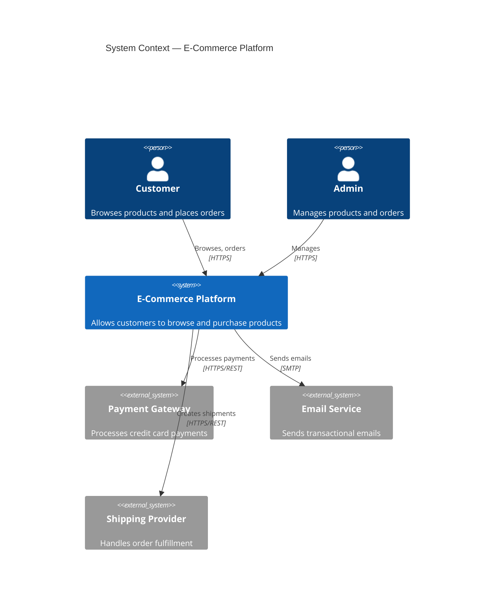
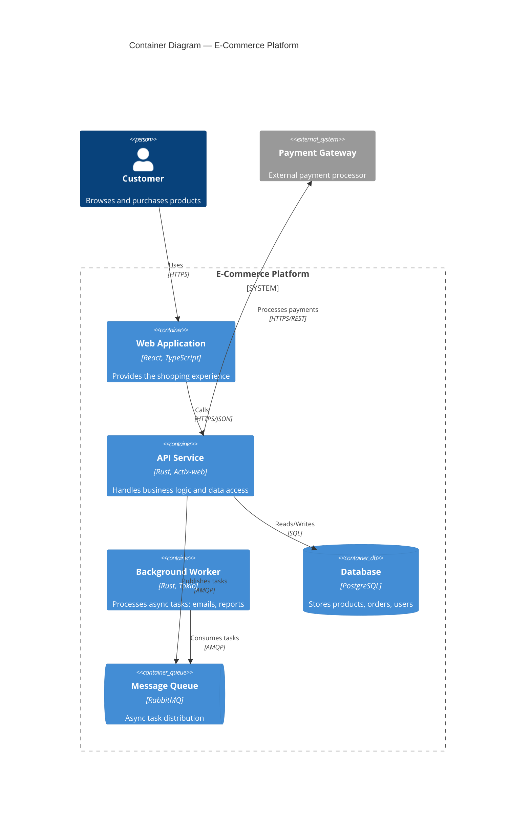
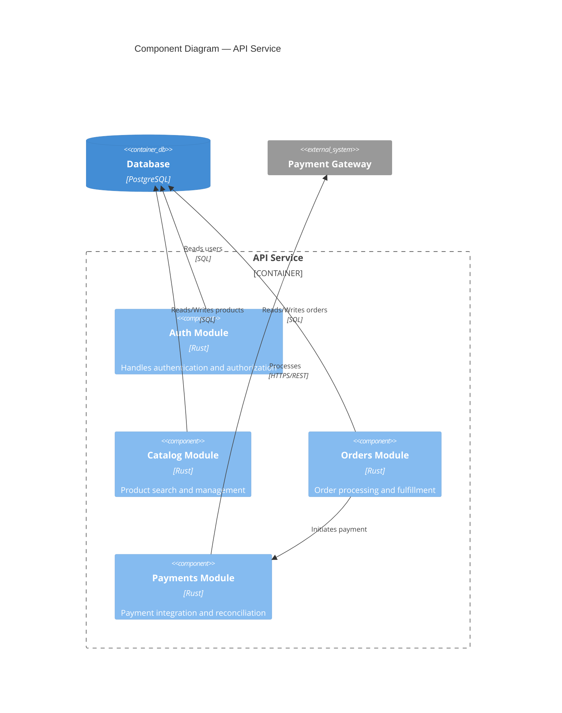
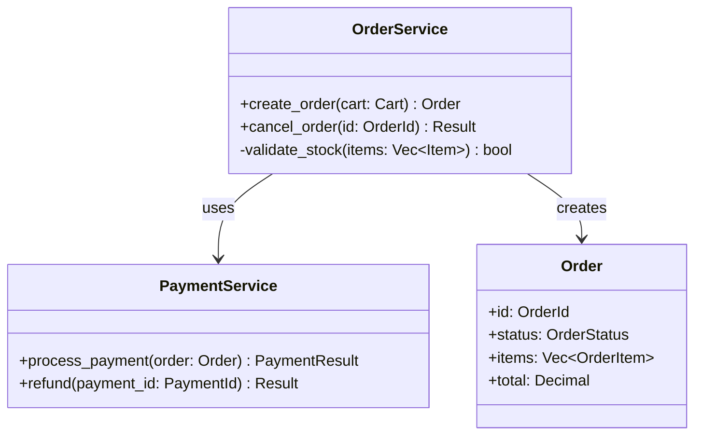

# C4 Model Diagram Guide

> This guide explains how to use the C4 Model with Mermaid syntax in DevTrail documents, particularly in ADR (Architecture Decision Record) documents.

**Languages**: English | [Español](i18n/es/C4-DIAGRAM-GUIDE.md)

---

## What is the C4 Model?

The C4 Model (Context, Containers, Components, Code) is a set of abstractions for visualizing software architecture at different zoom levels. Created by Simon Brown, it provides a consistent vocabulary for describing and communicating architecture.

Each level zooms into the previous one:

| Level | Shows | When to Use in DevTrail |
|-------|-------|------------------------|
| **1. Context** | System + users + external systems | ADR for system-level decisions, REQ for high-level requirements |
| **2. Container** | Applications, databases, services | ADR for service architecture, deployment decisions |
| **3. Component** | Internal modules within a container | ADR for module-level decisions, AILOG for significant refactors |
| **4. Code** | Classes, interfaces, functions | Rarely needed in DevTrail — use only for critical design patterns |

---

## Level 1: System Context

Shows who uses the system and what external systems it interacts with.



### Key Elements

| Element | Syntax | Description |
|---------|--------|-------------|
| Person | `Person(id, "Name", "Description")` | A user or role |
| System | `System(id, "Name", "Description")` | The system being documented |
| External System | `System_Ext(id, "Name", "Description")` | External dependency |
| Relationship | `Rel(from, to, "Label", "Technology")` | Communication flow |

---

## Level 2: Container

Zooms into the system to show the high-level technology choices: applications, data stores, and how they communicate.



### Key Elements

| Element | Syntax | Description |
|---------|--------|-------------|
| Boundary | `System_Boundary(id, "Name") { ... }` | Groups containers |
| Container | `Container(id, "Name", "Tech", "Description")` | An application or service |
| Database | `ContainerDb(id, "Name", "Tech", "Description")` | A data store |
| Queue | `ContainerQueue(id, "Name", "Tech", "Description")` | A message queue |

---

## Level 3: Component

Zooms into a single container to show its internal components.



### Key Elements

| Element | Syntax | Description |
|---------|--------|-------------|
| Boundary | `Container_Boundary(id, "Name") { ... }` | Groups components within a container |
| Component | `Component(id, "Name", "Tech", "Description")` | An internal module or package |

---

## Level 4: Code

Shows classes, interfaces, and their relationships. **Rarely needed** in DevTrail — use only for critical design patterns that require documentation.

For code-level diagrams, use standard Mermaid class diagrams instead of C4:



---

## PlantUML Alternative

For teams that prefer PlantUML, equivalent syntax is available using the [C4-PlantUML](https://github.com/plantuml-stdlib/C4-PlantUML) library.

### Context (PlantUML)

```plantuml
@startuml
!include https://raw.githubusercontent.com/plantuml-stdlib/C4-PlantUML/master/C4_Context.puml

Person(customer, "Customer", "Browses and purchases")
System(ecommerce, "E-Commerce Platform", "Shopping platform")
System_Ext(payment, "Payment Gateway", "Processes payments")

Rel(customer, ecommerce, "Uses", "HTTPS")
Rel(ecommerce, payment, "Processes payments", "REST")
@enduml
```

### Container (PlantUML)

```plantuml
@startuml
!include https://raw.githubusercontent.com/plantuml-stdlib/C4-PlantUML/master/C4_Container.puml

Person(customer, "Customer")
System_Boundary(c1, "E-Commerce Platform") {
    Container(webapp, "Web App", "React", "UI")
    Container(api, "API", "Rust", "Business logic")
    ContainerDb(db, "Database", "PostgreSQL", "Data store")
}

Rel(customer, webapp, "Uses", "HTTPS")
Rel(webapp, api, "Calls", "JSON/HTTPS")
Rel(api, db, "Reads/Writes", "SQL")
@enduml
```

---

## Integration with DevTrail Documents

### In ADR Documents

Add a C4 diagram in the `## Architecture Diagram` section when the decision:
- Introduces or removes a system, service, or data store
- Changes inter-service communication patterns
- Modifies system boundaries or deployment topology

### In REQ Documents

Use a Level 1 (Context) diagram to illustrate:
- Who interacts with the system
- What external systems are involved
- High-level data flows

### Choosing the Right Level

| Decision Scope | C4 Level | Example |
|---------------|----------|---------|
| "We will integrate with Stripe for payments" | Context | New external system |
| "We will split the monolith into microservices" | Container | New service architecture |
| "We will extract auth into a separate module" | Component | Internal restructuring |
| "We will use the Strategy pattern for pricing" | Code (class diagram) | Design pattern |

---

## References

- [C4 Model — Simon Brown](https://c4model.com/)
- [Mermaid C4 Diagrams](https://mermaid.js.org/syntax/c4.html)
- [C4-PlantUML](https://github.com/plantuml-stdlib/C4-PlantUML)

---

*DevTrail v4.0.0 | [Strange Days Tech](https://strangedays.tech)*
