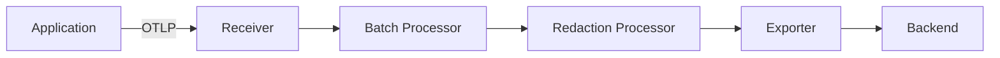

# Observability Guide — OpenTelemetry Integration for DevTrail Projects

> **This guide is optional.** Adopt it when your project instruments systems with OpenTelemetry.
> It complements the existing DevTrail governance documents and does not replace any of them.

---

## 1. Scope and Purpose

This guide provides a structured approach for projects that choose to adopt OpenTelemetry (OTel) as their observability framework. It is **not mandatory** — it becomes active when the team decides to instrument their systems.

The guide covers:

- **Signals**: which telemetry signals to collect and how they relate to each other
- **Configuration**: resource attributes, context propagation, and collector pipelines
- **Data policies**: what can and cannot be captured, retention, and security
- **DevTrail integration**: how observability work maps to existing document types

> **When to activate this guide**: Include it in your project governance when at least one service will emit traces, metrics, or structured logs via OpenTelemetry. Document the decision in an AIDEC or ADR.

---

## 2. Signals and Correlation

OpenTelemetry defines three core signals. Effective observability requires all three, correlated through shared identifiers.

| Signal | Purpose | Key Attributes | Correlation Method |
|--------|---------|----------------|-------------------|
| **Traces** | Distributed request flow across services | `trace_id`, `span_id`, business attributes (e.g., `user.tier`, `order.id`) | Parent-child span relationships via `traceparent` |
| **Metrics** | Quantitative measurements over time | Latency (histograms), error rate (counters), saturation (gauges), throughput (counters) | Exemplars linking metric samples to `trace_id` |
| **Logs** | Discrete events with structured context | `severity`, `body`, application-specific fields | `trace_id` and `span_id` injected into log records |

### How signals correlate

The `trace_id` is the universal correlation key:

- **Logs to Traces**: Each log record carries the `trace_id` and `span_id` of its active context, allowing direct navigation from a log line to the trace that produced it.
- **Traces to Metrics**: Exemplars on metric data points reference a `trace_id`, linking an aggregated measurement back to a specific request.
- **Metrics to Logs**: Metric alerts identify time windows; correlated logs within that window share the same resource attributes, enabling root-cause analysis.

> **Guidance**: Always ensure `trace_id` and `span_id` are present in log output. Without this correlation, the three signals remain isolated silos.

---

## 3. Minimum Resource Attributes

Resource attributes identify the source of telemetry data. Configure them once at application startup; they apply to all signals.

| Attribute | Requirement | Description | Example |
|-----------|-------------|-------------|---------|
| `service.name` | **Required** | Logical name of the service | `payment-api` |
| `service.version` | **Required** | Version of the deployed service | `2.4.1` |
| `deployment.environment` | **Required** | Deployment target | `production`, `staging`, `development` |
| `service.instance.id` | Recommended | Unique identifier for the instance | `pod-abc123`, `i-0a1b2c3d` |

> **Note**: These attributes align with the [OpenTelemetry Semantic Conventions for Resources](https://opentelemetry.io/docs/specs/semconv/resource/). Use additional semantic convention attributes (e.g., `host.name`, `cloud.region`, `k8s.namespace.name`) as needed for your deployment model.

---

## 4. Context Propagation

Context propagation ensures that a single request can be traced across service boundaries. DevTrail projects should use the **W3C Trace Context** standard.

### Headers

- **`traceparent`**: Carries the `trace_id`, `span_id`, and trace flags. This is the minimum required header.
- **`tracestate`**: Carries vendor-specific or application-specific key-value pairs. Optional but useful for multi-vendor environments.

### Propagation by Transport

| Transport | Propagation Method | Notes |
|-----------|-------------------|-------|
| HTTP (synchronous) | `traceparent` / `tracestate` headers | Most SDKs inject automatically |
| Message queues (Kafka, RabbitMQ, SQS) | Message headers or attributes | Requires explicit instrumentation; set `traceparent` as a message attribute |
| Async / background jobs | Job metadata or payload | Pass `traceparent` as part of the job envelope; restore context on the worker side |
| gRPC | Metadata headers | Auto-instrumented by most OTel gRPC interceptors |

### Auto-instrumentation vs Manual Instrumentation

- **Auto-instrumentation** (agents, libraries): Handles HTTP and gRPC propagation automatically. Prefer this as the starting point.
- **Manual instrumentation**: Required for message queues, background jobs, and custom protocols. The developer must explicitly inject and extract context.

> **Guidance**: Start with auto-instrumentation for HTTP/gRPC. Add manual instrumentation incrementally for message-based and async flows. Document each instrumentation change in an AILOG.

---

## 5. Collector Pipeline Architecture

The OpenTelemetry Collector acts as a central telemetry processing gateway between applications and backends. Structure it with clear separation of concerns.

### Pipeline Stages

1. **Receivers**: Accept telemetry from applications via OTLP (gRPC on port 4317, HTTP on port 4318).
2. **Processors**: Transform, filter, and enrich data before export.
   - **Batch Processor**: Groups data into batches for efficient export.
   - **Redaction Processor**: Removes or masks sensitive attributes (see Section 7).
   - **Resource Processor**: Enriches data with additional resource attributes.
3. **Exporters**: Send processed data to the observability backend (e.g., Jaeger, Prometheus, Loki, Grafana Cloud, Datadog).

### Pipeline Diagram

### Separate Pipelines

Configure independent pipelines for each signal type:

| Pipeline | Receiver | Processors | Exporter |
|----------|----------|-----------|----------|
| **Traces** | `otlp` | `batch`, `redaction`, `resource` | Trace backend (e.g., Jaeger, Tempo) |
| **Metrics** | `otlp` | `batch`, `resource` | Metrics backend (e.g., Prometheus, Mimir) |
| **Logs** | `otlp` | `batch`, `redaction`, `resource` | Log backend (e.g., Loki, Elasticsearch) |

> **Guidance**: Run the Collector as a sidecar or daemon in production. Avoid sending telemetry directly from applications to backends — the Collector provides buffering, retry, and security enforcement.

---

## 6. Sampling and Retention

Sampling controls the volume of telemetry data collected. The right strategy balances cost against observability coverage.

### Sampling Strategies

| Strategy | When to Use | Trade-offs |
|----------|-------------|------------|
| **Head sampling** | Predictable traffic, cost-sensitive environments | Decision made at trace start; simple to configure; may miss rare errors |
| **Tail sampling** | Need to capture all errors and slow traces | Decision made after trace completes; captures important traces; requires Collector with memory for pending traces |
| **Always-on** (100%) | Low-traffic services, development, staging | Full visibility; high storage cost; not suitable for high-throughput production |
| **Rate limiting** | Protecting backend from burst traffic | Caps volume per second; complements other strategies |

### Retention Policies

| Environment | Minimum Retention | Rationale |
|-------------|-------------------|-----------|
| **Production** | 30 days | Incident investigation, trend analysis, compliance |
| **Staging** | 7 days | Pre-release validation and debugging |
| **Development** | 1 day | Rapid iteration; no long-term storage needed |

> **Guidance**: Use head sampling for most production services. Add tail sampling at the Collector level to ensure errors (HTTP 5xx, exceptions) and slow traces (above P99 latency) are always captured regardless of head sampling rate.

---

## 7. Data Policies and Security

> **CRITICAL**: Never capture personally identifiable information (PII), authentication tokens, API keys, passwords, or secrets in OpenTelemetry attributes, span events, or log bodies. Violations may breach GDPR, internal security policies, and user trust.

### Policy Requirements

| Policy | Requirement | Implementation |
|--------|-------------|----------------|
| **Attribute allowlist** | Only explicitly permitted attributes may be captured | Maintain an allowlist in the Collector configuration; reject unlisted attributes |
| **PII prohibition** | No PII in spans, metrics labels, or log bodies | Redaction processor strips fields matching PII patterns (email, IP, credit card) |
| **Encryption in transit** | All telemetry data encrypted between application, Collector, and backend | TLS for OTLP gRPC/HTTP; mTLS recommended for production |
| **Encryption at rest** | Telemetry stored encrypted in the backend | Backend-level encryption; verify with infrastructure team |
| **Access control** | Role-based access to telemetry data | Separate access by environment (production vs staging); limit production trace access to on-call and incident responders |
| **Automatic scrubbing** | Collector-level redaction as a safety net | Configure the `redaction` processor with patterns for tokens, secrets, and PII |

### Allowlist Approach

Rather than trying to block every sensitive field, define an explicit allowlist of permitted attributes:

1. Start with OTel Semantic Convention attributes (these are safe by design).
2. Add business attributes only after review (e.g., `order.id` is acceptable; `user.email` is not).
3. Document the allowlist in the Collector configuration and review it during observability changes.

> **Guidance**: Treat the Collector's redaction processor as a safety net, not the primary defense. The primary defense is developer awareness and code review of instrumentation changes.

---

## 8. DevTrail Integration

Observability work generates artifacts that must be documented within the DevTrail framework. Use the following mapping to determine which document type to create or update.

| Change | DevTrail Document | Notes |
|--------|-------------------|-------|
| Instrumentation changes (new spans, attributes) | **AILOG** | Tag: `observabilidad` |
| Backend selection decision | **AIDEC** or **ADR** | Depending on scope; AIDEC for AI-assisted decisions, ADR for architectural decisions |
| Observability requirements | **REQ** | Section: Observability Requirements |
| Propagation tests | **TES** | Section: Observability Tests |
| Incident with trace evidence | **INC** | Include `trace_id`, `span_id` in the incident record |
| Instrumentation debt | **TDE** | Technical debt tracking for missing or incomplete instrumentation |
| Telemetry privacy assessment | **ETH** | Data Privacy section; assess what telemetry captures |
| Security of telemetry pipeline | **SEC** | Assessment of Collector security, access control, encryption |

> **Guidance**: When making instrumentation changes, always create an AILOG entry tagged with `observabilidad`. This provides an audit trail of what is being observed and why.

---

## 9. Adoption Roadmap

Adopt OpenTelemetry incrementally. Each phase builds on the previous one and produces specific DevTrail documents.

### Phase 0 — Decision

- Create an **AIDEC** or **ADR** documenting the decision to adopt OpenTelemetry.
- Evaluate and select the observability backend.
- Define initial data policies (allowlist, retention, access).
- Create an **ETH** if telemetry may capture user-adjacent data.

### Phase 1 — Minimum Instrumentation

- Instrument critical endpoints (API entry points, key business operations).
- Configure resource attributes: `service.name`, `service.version`, `deployment.environment`.
- Deploy the OpenTelemetry Collector with basic pipelines (batch + export).
- Create a **REQ** with initial observability requirements.
- Log instrumentation changes in **AILOG** entries.

### Phase 2 — Full Coverage

- Extend instrumentation to all services and async flows.
- Configure W3C Trace Context propagation across all transports.
- Add the redaction processor to the Collector pipeline.
- Implement sampling strategy (head + tail).
- Create **TES** entries validating trace propagation and log correlation.

### Phase 3 — Operational Integration

- Integrate trace evidence into **INC** records (`trace_id`, `span_id` for incidents).
- Define observability SLOs in **REQ** documents (e.g., "P99 latency < 200ms").
- Automate propagation tests in CI (referenced in **TES**).
- Track instrumentation gaps as **TDE** entries.
- Review and update the attribute allowlist quarterly.

---

## 10. Checklist

Use this checklist to verify that your project's OpenTelemetry integration is complete and aligned with DevTrail governance.

- [ ] **AIDEC/ADR** documenting the OTel adoption decision and backend selection
- [ ] **REQ** with observability requirements and SLOs
- [ ] Resource attributes configured (`service.name`, `service.version`, `deployment.environment`)
- [ ] W3C Trace Context propagation verified across all transports
- [ ] Sensitive data redaction configured in the Collector pipeline
- [ ] **TES** validating trace propagation and log correlation
- [ ] **INC** template updated with `trace_id` / `span_id` fields
- [ ] **AILOG** created for instrumentation changes with tag `observabilidad`
- [ ] **ETH** covering telemetry data privacy and PII assessment

---

## Regulatory Alignment

OpenTelemetry instrumentation supports compliance with several regulatory and standards frameworks relevant to DevTrail projects.

| Standard | Reference | Relevance |
|----------|-----------|-----------|
| **EU AI Act** | Art. 72 (Post-market monitoring) | OTel provides the monitoring infrastructure required for continuous post-market surveillance of AI systems |
| **NIST AI RMF** | MEASURE function | Operational metrics collected via OTel serve as measurement tools for AI risk management |
| **GDPR** | Art. 5 (Data minimization) | Telemetry must not collect PII; the allowlist approach and redaction processor enforce data minimization |
| **ISO/IEC 25010:2023** | Reliability, Performance Efficiency | OTel traces and metrics provide evidence for observable quality characteristics |
| **ISO/IEC 42001** | A.6.2.6 (Operation and Monitoring) | Continuous operational evidence from OTel supports AI management system monitoring requirements |
| **ISO/IEC 42001** | A.5.2 (Risk Assessment) | Operational data collected through OTel informs ongoing risk assessment and mitigation |

> **Guidance**: When preparing for audits or compliance reviews, use OTel data exports alongside DevTrail documents (REQ, INC, ETH) to demonstrate continuous monitoring and data governance.

---

<!-- Template: DevTrail | https://strangedays.tech -->
