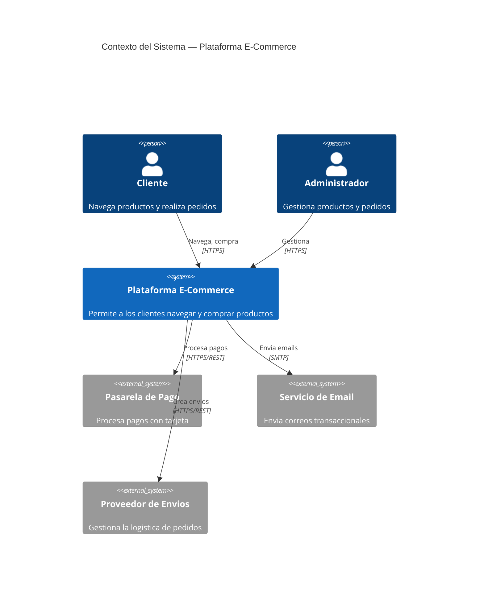
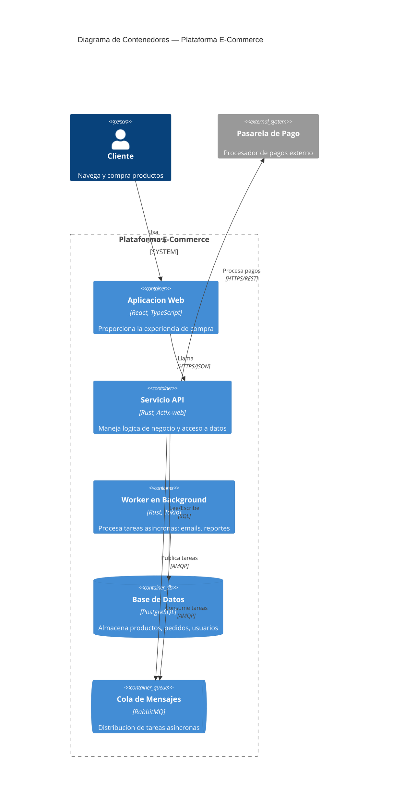
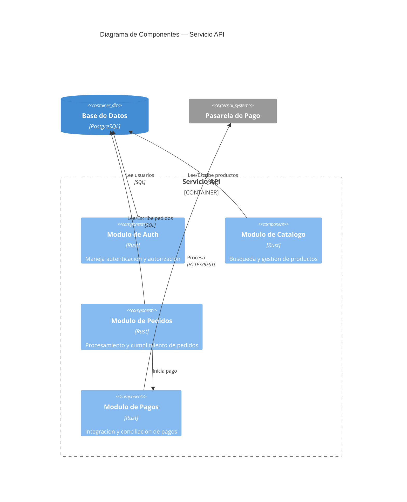
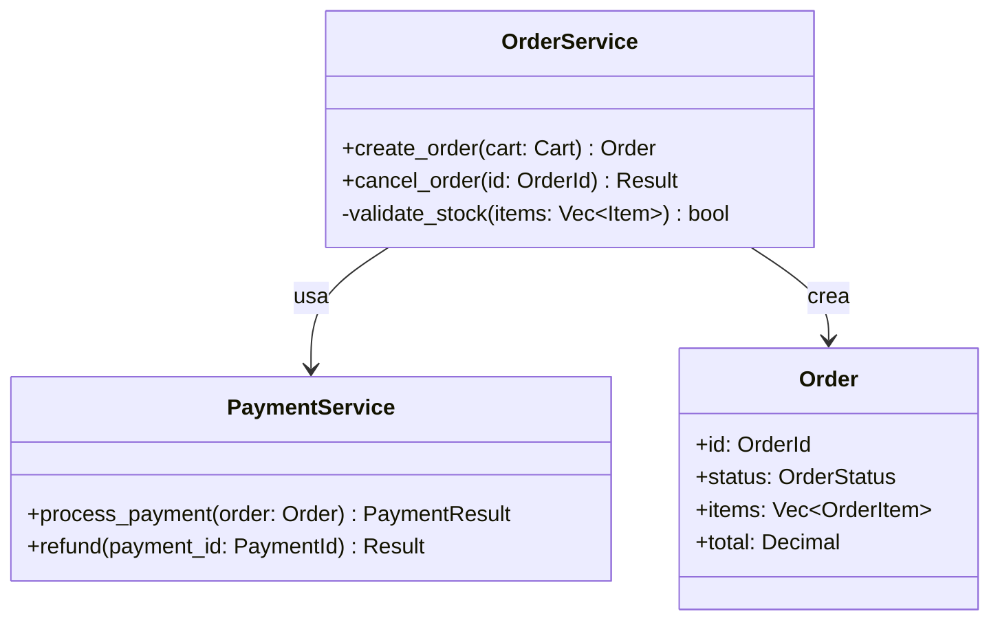

# Guia de Diagramas con Modelo C4

> Esta guia explica como usar el Modelo C4 con sintaxis Mermaid en documentos DevTrail, particularmente en documentos ADR (Architecture Decision Record).

**Idiomas**: [English](../../C4-DIAGRAM-GUIDE.md) | Español

---

## Que es el Modelo C4?

El Modelo C4 (Context, Containers, Components, Code) es un conjunto de abstracciones para visualizar arquitectura de software en diferentes niveles de zoom. Creado por Simon Brown, proporciona un vocabulario consistente para describir y comunicar la arquitectura.

Cada nivel hace zoom en el anterior:

| Nivel | Muestra | Cuando Usarlo en DevTrail |
|-------|---------|--------------------------|
| **1. Contexto** | Sistema + usuarios + sistemas externos | ADR para decisiones a nivel de sistema, REQ para requisitos de alto nivel |
| **2. Contenedor** | Aplicaciones, bases de datos, servicios | ADR para arquitectura de servicios, decisiones de despliegue |
| **3. Componente** | Modulos internos dentro de un contenedor | ADR para decisiones a nivel de modulo, AILOG para refactorizaciones significativas |
| **4. Codigo** | Clases, interfaces, funciones | Raramente necesario en DevTrail — usar solo para patrones de diseno criticos |

---

## Nivel 1: Contexto del Sistema

Muestra quien usa el sistema y con que sistemas externos interactua.



### Elementos Clave

| Elemento | Sintaxis | Descripcion |
|----------|----------|-------------|
| Persona | `Person(id, "Nombre", "Descripcion")` | Un usuario o rol |
| Sistema | `System(id, "Nombre", "Descripcion")` | El sistema que se documenta |
| Sistema Externo | `System_Ext(id, "Nombre", "Descripcion")` | Dependencia externa |
| Relacion | `Rel(from, to, "Etiqueta", "Tecnologia")` | Flujo de comunicacion |

---

## Nivel 2: Contenedor

Hace zoom en el sistema para mostrar las decisiones tecnologicas de alto nivel: aplicaciones, almacenes de datos y como se comunican.



### Elementos Clave

| Elemento | Sintaxis | Descripcion |
|----------|----------|-------------|
| Frontera | `System_Boundary(id, "Nombre") { ... }` | Agrupa contenedores |
| Contenedor | `Container(id, "Nombre", "Tech", "Descripcion")` | Una aplicacion o servicio |
| Base de Datos | `ContainerDb(id, "Nombre", "Tech", "Descripcion")` | Un almacen de datos |
| Cola | `ContainerQueue(id, "Nombre", "Tech", "Descripcion")` | Una cola de mensajes |

---

## Nivel 3: Componente

Hace zoom en un contenedor individual para mostrar sus componentes internos.



### Elementos Clave

| Elemento | Sintaxis | Descripcion |
|----------|----------|-------------|
| Frontera | `Container_Boundary(id, "Nombre") { ... }` | Agrupa componentes dentro de un contenedor |
| Componente | `Component(id, "Nombre", "Tech", "Descripcion")` | Un modulo o paquete interno |

---

## Nivel 4: Codigo

Muestra clases, interfaces y sus relaciones. **Raramente necesario** en DevTrail — usar solo para patrones de diseno criticos que requieran documentacion.

Para diagramas a nivel de codigo, usar diagramas de clases estandar de Mermaid en lugar de C4:



---

## Alternativa PlantUML

Para equipos que prefieren PlantUML, la sintaxis equivalente esta disponible usando la biblioteca [C4-PlantUML](https://github.com/plantuml-stdlib/C4-PlantUML).

### Contexto (PlantUML)

```plantuml
@startuml
!include https://raw.githubusercontent.com/plantuml-stdlib/C4-PlantUML/master/C4_Context.puml

Person(customer, "Cliente", "Navega y compra")
System(ecommerce, "Plataforma E-Commerce", "Plataforma de compras")
System_Ext(payment, "Pasarela de Pago", "Procesa pagos")

Rel(customer, ecommerce, "Usa", "HTTPS")
Rel(ecommerce, payment, "Procesa pagos", "REST")
@enduml
```

### Contenedor (PlantUML)

```plantuml
@startuml
!include https://raw.githubusercontent.com/plantuml-stdlib/C4-PlantUML/master/C4_Container.puml

Person(customer, "Cliente")
System_Boundary(c1, "Plataforma E-Commerce") {
    Container(webapp, "App Web", "React", "Interfaz")
    Container(api, "API", "Rust", "Logica de negocio")
    ContainerDb(db, "Base de Datos", "PostgreSQL", "Almacen de datos")
}

Rel(customer, webapp, "Usa", "HTTPS")
Rel(webapp, api, "Llama", "JSON/HTTPS")
Rel(api, db, "Lee/Escribe", "SQL")
@enduml
```

---

## Integracion con Documentos DevTrail

### En Documentos ADR

Agregar un diagrama C4 en la seccion `## Diagrama de Arquitectura` cuando la decision:
- Introduce o elimina un sistema, servicio o almacen de datos
- Cambia patrones de comunicacion entre servicios
- Modifica fronteras del sistema o topologia de despliegue

### En Documentos REQ

Usar un diagrama de Nivel 1 (Contexto) para ilustrar:
- Quien interactua con el sistema
- Que sistemas externos estan involucrados
- Flujos de datos de alto nivel

### Elegir el Nivel Correcto

| Alcance de la Decision | Nivel C4 | Ejemplo |
|------------------------|----------|---------|
| "Integraremos con Stripe para pagos" | Contexto | Nuevo sistema externo |
| "Dividiremos el monolito en microservicios" | Contenedor | Nueva arquitectura de servicios |
| "Extraeremos auth en un modulo separado" | Componente | Reestructuracion interna |
| "Usaremos el patron Strategy para precios" | Codigo (diagrama de clases) | Patron de diseno |

---

## Referencias

- [Modelo C4 — Simon Brown](https://c4model.com/)
- [Diagramas C4 en Mermaid](https://mermaid.js.org/syntax/c4.html)
- [C4-PlantUML](https://github.com/plantuml-stdlib/C4-PlantUML)

---

*DevTrail v4.0.0 | [Strange Days Tech](https://strangedays.tech)*
