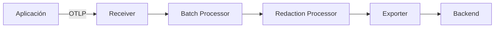

# Guía de Observabilidad — Integración de OpenTelemetry para Proyectos DevTrail

> **Esta guía es opcional.** Adóptala cuando tu proyecto instrumente sistemas con OpenTelemetry.
> Complementa los documentos de gobernanza existentes de DevTrail y no reemplaza ninguno de ellos.

---

## 1. Alcance y Propósito

Esta guía proporciona un enfoque estructurado para proyectos que eligen adoptar OpenTelemetry (OTel) como su framework de observabilidad. **No es obligatoria** — se activa cuando el equipo decide instrumentar sus sistemas.

La guía cubre:

- **Señales**: qué señales de telemetría recolectar y cómo se relacionan entre sí
- **Configuración**: atributos de recurso, propagación de contexto y pipelines del Collector
- **Políticas de datos**: qué se puede y no se puede capturar, retención y seguridad
- **Integración con DevTrail**: cómo el trabajo de observabilidad se mapea a tipos de documentos existentes

> **Cuándo activar esta guía**: Inclúyela en la gobernanza de tu proyecto cuando al menos un servicio emita trazas, métricas o logs estructurados vía OpenTelemetry. Documenta la decisión en un AIDEC o ADR.

---

## 2. Señales y Correlación

OpenTelemetry define tres señales principales. Una observabilidad efectiva requiere las tres, correlacionadas a través de identificadores compartidos.

| Señal | Propósito | Atributos Clave | Método de Correlación |
|-------|-----------|-----------------|----------------------|
| **Trazas** | Flujo distribuido de solicitudes entre servicios | `trace_id`, `span_id`, atributos de negocio (ej., `user.tier`, `order.id`) | Relaciones padre-hijo de spans vía `traceparent` |
| **Métricas** | Mediciones cuantitativas en el tiempo | Latencia (histogramas), tasa de error (contadores), saturación (gauges), throughput (contadores) | Exemplars vinculando muestras de métricas a `trace_id` |
| **Logs** | Eventos discretos con contexto estructurado | `severity`, `body`, campos específicos de la aplicación | `trace_id` y `span_id` inyectados en registros de log |

### Cómo se correlacionan las señales

El `trace_id` es la clave universal de correlación:

- **Logs a Trazas**: Cada registro de log porta el `trace_id` y `span_id` de su contexto activo, permitiendo navegación directa desde una línea de log hasta la traza que la produjo.
- **Trazas a Métricas**: Los exemplars en puntos de datos de métricas referencian un `trace_id`, vinculando una medición agregada a una solicitud específica.
- **Métricas a Logs**: Las alertas de métricas identifican ventanas de tiempo; los logs correlacionados dentro de esa ventana comparten los mismos atributos de recurso, permitiendo análisis de causa raíz.

> **Guía**: Siempre asegúrate de que `trace_id` y `span_id` estén presentes en la salida de logs. Sin esta correlación, las tres señales permanecen como silos aislados.

---

## 3. Atributos Mínimos de Recurso

Los atributos de recurso identifican la fuente de datos de telemetría. Configúralos una vez al inicio de la aplicación; se aplican a todas las señales.

| Atributo | Requisito | Descripción | Ejemplo |
|----------|-----------|-------------|---------|
| `service.name` | **Obligatorio** | Nombre lógico del servicio | `payment-api` |
| `service.version` | **Obligatorio** | Versión del servicio desplegado | `2.4.1` |
| `deployment.environment` | **Obligatorio** | Entorno de despliegue | `production`, `staging`, `development` |
| `service.instance.id` | Recomendado | Identificador único de la instancia | `pod-abc123`, `i-0a1b2c3d` |

> **Nota**: Estos atributos están alineados con las [Convenciones Semánticas de OpenTelemetry para Recursos](https://opentelemetry.io/docs/specs/semconv/resource/). Usa atributos adicionales de convenciones semánticas (ej., `host.name`, `cloud.region`, `k8s.namespace.name`) según tu modelo de despliegue.

---

## 4. Propagación de Contexto

La propagación de contexto asegura que una solicitud individual pueda ser rastreada a través de fronteras de servicio. Los proyectos DevTrail deben usar el estándar **W3C Trace Context**.

### Headers

- **`traceparent`**: Porta el `trace_id`, `span_id` y flags de traza. Es el header mínimo requerido.
- **`tracestate`**: Porta pares clave-valor específicos del proveedor o aplicación. Opcional pero útil en entornos multi-proveedor.

### Propagación por Transporte

| Transporte | Método de Propagación | Notas |
|------------|----------------------|-------|
| HTTP (síncrono) | Headers `traceparent` / `tracestate` | La mayoría de SDKs inyectan automáticamente |
| Colas de mensajes (Kafka, RabbitMQ, SQS) | Headers o atributos del mensaje | Requiere instrumentación explícita; establecer `traceparent` como atributo del mensaje |
| Async / jobs en background | Metadata del job o payload | Pasar `traceparent` como parte del envelope del job; restaurar contexto en el worker |
| gRPC | Headers de metadata | Auto-instrumentado por la mayoría de interceptores OTel gRPC |

### Auto-instrumentación vs Instrumentación Manual

- **Auto-instrumentación** (agentes, bibliotecas): Maneja la propagación HTTP y gRPC automáticamente. Preferir esto como punto de partida.
- **Instrumentación manual**: Requerida para colas de mensajes, jobs en background y protocolos personalizados. El desarrollador debe inyectar y extraer contexto explícitamente.

> **Guía**: Comienza con auto-instrumentación para HTTP/gRPC. Agrega instrumentación manual incrementalmente para flujos basados en mensajes y asíncronos. Documenta cada cambio de instrumentación en un AILOG.

---

## 5. Arquitectura del Pipeline del Collector

El OpenTelemetry Collector actúa como gateway central de procesamiento de telemetría entre aplicaciones y backends. Estructúralo con clara separación de responsabilidades.

### Etapas del Pipeline

1. **Receivers**: Aceptan telemetría de aplicaciones vía OTLP (gRPC en puerto 4317, HTTP en puerto 4318).
2. **Processors**: Transforman, filtran y enriquecen datos antes de exportar.
   - **Batch Processor**: Agrupa datos en lotes para exportación eficiente.
   - **Redaction Processor**: Elimina o enmascara atributos sensibles (ver Sección 7).
   - **Resource Processor**: Enriquece datos con atributos de recurso adicionales.
3. **Exporters**: Envían datos procesados al backend de observabilidad (ej., Jaeger, Prometheus, Loki, Grafana Cloud, Datadog).

### Diagrama del Pipeline

### Pipelines Separados

Configura pipelines independientes para cada tipo de señal:

| Pipeline | Receiver | Processors | Exporter |
|----------|----------|-----------|----------|
| **Trazas** | `otlp` | `batch`, `redaction`, `resource` | Backend de trazas (ej., Jaeger, Tempo) |
| **Métricas** | `otlp` | `batch`, `resource` | Backend de métricas (ej., Prometheus, Mimir) |
| **Logs** | `otlp` | `batch`, `redaction`, `resource` | Backend de logs (ej., Loki, Elasticsearch) |

> **Guía**: Ejecuta el Collector como sidecar o daemon en producción. Evita enviar telemetría directamente desde aplicaciones a backends — el Collector proporciona buffering, reintentos y cumplimiento de seguridad.

---

## 6. Muestreo y Retención

El muestreo controla el volumen de datos de telemetría recolectados. La estrategia correcta equilibra costo contra cobertura de observabilidad.

### Estrategias de Muestreo

| Estrategia | Cuándo Usar | Compromisos |
|------------|-------------|-------------|
| **Head sampling** | Tráfico predecible, entornos sensibles al costo | Decisión al inicio de la traza; simple de configurar; puede perder errores raros |
| **Tail sampling** | Necesidad de capturar todos los errores y trazas lentas | Decisión después de completar la traza; captura trazas importantes; requiere Collector con memoria para trazas pendientes |
| **Always-on** (100%) | Servicios de bajo tráfico, desarrollo, staging | Visibilidad total; alto costo de almacenamiento; no apto para producción de alto throughput |
| **Rate limiting** | Protección del backend contra ráfagas de tráfico | Limita volumen por segundo; complementa otras estrategias |

### Políticas de Retención

| Entorno | Retención Mínima | Justificación |
|---------|------------------|---------------|
| **Producción** | 30 días | Investigación de incidentes, análisis de tendencias, compliance |
| **Staging** | 7 días | Validación pre-release y depuración |
| **Desarrollo** | 1 día | Iteración rápida; no se necesita almacenamiento a largo plazo |

> **Guía**: Usa head sampling para la mayoría de servicios en producción. Agrega tail sampling a nivel del Collector para asegurar que errores (HTTP 5xx, excepciones) y trazas lentas (superiores al P99 de latencia) siempre se capturen sin importar la tasa de head sampling.

---

## 7. Políticas de Datos y Seguridad

> **CRÍTICO**: Nunca captures información de identificación personal (PII), tokens de autenticación, claves API, contraseñas o secretos en atributos de OpenTelemetry, eventos de spans o cuerpos de logs. Las violaciones pueden infringir GDPR, políticas internas de seguridad y la confianza del usuario.

### Requisitos de Políticas

| Política | Requisito | Implementación |
|----------|-----------|----------------|
| **Allowlist de atributos** | Solo atributos explícitamente permitidos pueden ser capturados | Mantener un allowlist en la configuración del Collector; rechazar atributos no listados |
| **Prohibición de PII** | No PII en spans, etiquetas de métricas o cuerpos de logs | Redaction processor elimina campos que coinciden con patrones PII (email, IP, tarjeta de crédito) |
| **Cifrado en tránsito** | Todos los datos de telemetría cifrados entre aplicación, Collector y backend | TLS para OTLP gRPC/HTTP; mTLS recomendado para producción |
| **Cifrado en reposo** | Telemetría almacenada cifrada en el backend | Cifrado a nivel de backend; verificar con equipo de infraestructura |
| **Control de acceso** | Acceso basado en roles a datos de telemetría | Separar acceso por entorno (producción vs staging); limitar acceso a trazas de producción a on-call y respondedores de incidentes |
| **Scrubbing automático** | Redacción a nivel de Collector como red de seguridad | Configurar el procesador `redaction` con patrones para tokens, secretos y PII |

### Enfoque de Allowlist

En lugar de intentar bloquear cada campo sensible, define un allowlist explícito de atributos permitidos:

1. Comienza con atributos de Convenciones Semánticas de OTel (estos son seguros por diseño).
2. Agrega atributos de negocio solo después de revisión (ej., `order.id` es aceptable; `user.email` no lo es).
3. Documenta el allowlist en la configuración del Collector y revísalo durante cambios de observabilidad.

> **Guía**: Trata el procesador de redacción del Collector como una red de seguridad, no como la defensa primaria. La defensa primaria es la conciencia del desarrollador y la revisión de código de cambios de instrumentación.

---

## 8. Integración con DevTrail

El trabajo de observabilidad genera artefactos que deben documentarse dentro del framework DevTrail. Usa el siguiente mapeo para determinar qué tipo de documento crear o actualizar.

| Cambio | Documento DevTrail | Notas |
|--------|-------------------|-------|
| Cambios de instrumentación (nuevos spans, atributos) | **AILOG** | Tag: `observabilidad` |
| Decisión de selección de backend | **AIDEC** o **ADR** | Dependiendo del alcance; AIDEC para decisiones asistidas por IA, ADR para decisiones arquitectónicas |
| Requisitos de observabilidad | **REQ** | Sección: Requisitos de Observabilidad |
| Pruebas de propagación | **TES** | Sección: Pruebas de Observabilidad |
| Incidente con evidencia de trazas | **INC** | Incluir `trace_id`, `span_id` en el registro del incidente |
| Deuda de instrumentación | **TDE** | Seguimiento de deuda técnica para instrumentación faltante o incompleta |
| Evaluación de privacidad de telemetría | **ETH** | Sección de Privacidad de Datos; evaluar qué captura la telemetría |
| Seguridad del pipeline de telemetría | **SEC** | Evaluación de seguridad del Collector, control de acceso, cifrado |

> **Guía**: Al realizar cambios de instrumentación, siempre crea una entrada AILOG con tag `observabilidad`. Esto proporciona un rastro de auditoría de qué se está observando y por qué.

---

## 9. Hoja de Ruta de Adopción

Adopta OpenTelemetry incrementalmente. Cada fase se construye sobre la anterior y produce documentos DevTrail específicos.

### Fase 0 — Decisión

- Crear un **AIDEC** o **ADR** documentando la decisión de adoptar OpenTelemetry.
- Evaluar y seleccionar el backend de observabilidad.
- Definir políticas iniciales de datos (allowlist, retención, acceso).
- Crear un **ETH** si la telemetría puede capturar datos adyacentes al usuario.

### Fase 1 — Instrumentación Mínima

- Instrumentar endpoints críticos (puntos de entrada API, operaciones clave de negocio).
- Configurar atributos de recurso: `service.name`, `service.version`, `deployment.environment`.
- Desplegar el OpenTelemetry Collector con pipelines básicos (batch + export).
- Crear un **REQ** con requisitos iniciales de observabilidad.
- Registrar cambios de instrumentación en entradas **AILOG**.

### Fase 2 — Cobertura Completa

- Extender instrumentación a todos los servicios y flujos asíncronos.
- Configurar propagación W3C Trace Context en todos los transportes.
- Agregar el procesador de redacción al pipeline del Collector.
- Implementar estrategia de muestreo (head + tail).
- Crear entradas **TES** validando propagación de trazas y correlación de logs.

### Fase 3 — Integración Operativa

- Integrar evidencia de trazas en registros **INC** (`trace_id`, `span_id` para incidentes).
- Definir SLOs de observabilidad en documentos **REQ** (ej., "latencia P99 < 200ms").
- Automatizar pruebas de propagación en CI (referenciadas en **TES**).
- Rastrear brechas de instrumentación como entradas **TDE**.
- Revisar y actualizar el allowlist de atributos trimestralmente.

---

## 10. Checklist

Usa esta lista de verificación para confirmar que la integración de OpenTelemetry de tu proyecto está completa y alineada con la gobernanza DevTrail.

- [ ] **AIDEC/ADR** documentando la decisión de adopción de OTel y selección de backend
- [ ] **REQ** con requisitos de observabilidad y SLOs
- [ ] Atributos de recurso configurados (`service.name`, `service.version`, `deployment.environment`)
- [ ] Propagación W3C Trace Context verificada en todos los transportes
- [ ] Redacción de datos sensibles configurada en el pipeline del Collector
- [ ] **TES** validando propagación de trazas y correlación de logs
- [ ] Template de **INC** actualizado con campos `trace_id` / `span_id`
- [ ] **AILOG** creado para cambios de instrumentación con tag `observabilidad`
- [ ] **ETH** cubriendo privacidad de datos de telemetría y evaluación de PII

---

## Alineación Regulatoria

La instrumentación con OpenTelemetry apoya el cumplimiento de varios frameworks regulatorios y de estándares relevantes para proyectos DevTrail.

| Estándar | Referencia | Relevancia |
|----------|-----------|------------|
| **EU AI Act** | Art. 72 (Vigilancia post-mercado) | OTel proporciona la infraestructura de monitoreo requerida para vigilancia continua post-mercado de sistemas de IA |
| **NIST AI RMF** | Función MEASURE | Las métricas operativas recolectadas vía OTel sirven como herramientas de medición para la gestión de riesgos de IA |
| **GDPR** | Art. 5 (Minimización de datos) | La telemetría no debe recolectar PII; el enfoque de allowlist y el procesador de redacción aplican minimización de datos |
| **ISO/IEC 25010:2023** | Fiabilidad, Eficiencia de Desempeño | Las trazas y métricas de OTel proporcionan evidencia para características de calidad observables |
| **ISO/IEC 42001** | A.6.2.6 (Operación y Monitoreo) | Evidencia operativa continua de OTel apoya los requisitos de monitoreo del sistema de gestión de IA |
| **ISO/IEC 42001** | A.5.2 (Evaluación de Riesgos) | Los datos operativos recolectados a través de OTel informan la evaluación continua de riesgos y mitigación |

> **Guía**: Al preparar auditorías o revisiones de compliance, usa exportaciones de datos OTel junto con documentos DevTrail (REQ, INC, ETH) para demostrar monitoreo continuo y gobernanza de datos.

---

<!-- Template: DevTrail | https://strangedays.tech -->
