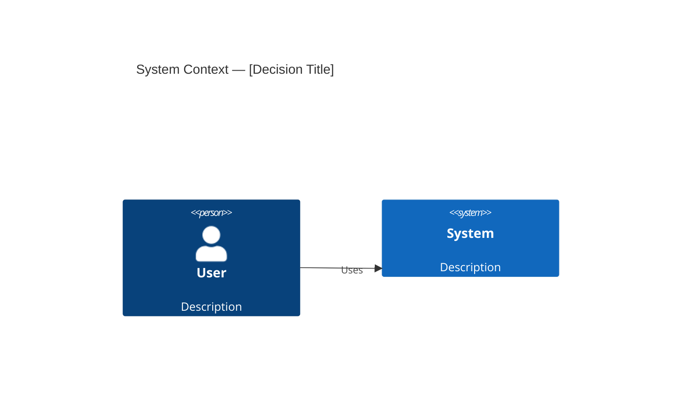

# ADR: [Architectural Decision Title]

## Status

[draft | accepted | deprecated | superseded]

**Note**: This document was created by an AI agent and requires human review.

> **Immutability Rule**: Once an ADR reaches `accepted` status, it MUST NOT be modified. If the decision changes, create a new ADR with `supersedes: ADR-YYYY-MM-DD-NNN` in its frontmatter. The original ADR's status changes to `superseded`.

## Context

[Describe the technical and business context. What forces are at play (technological, political, social, project-related). The language should be neutral, simply describing the facts.]

## Decision

[Describe the architectural decision and the justification. Use active voice: "We will use...", "We will implement..."]

## Alternatives Considered

### 1. [Alternative 1]
- **Description**: [What it is]
- **Pros**: [Advantages]
- **Cons**: [Disadvantages]
- **Why not**: [Reason for discarding]

### 2. [Alternative 2]
- **Description**: [What it is]
- **Pros**: [Advantages]
- **Cons**: [Disadvantages]
- **Why not**: [Reason for discarding]

## Consequences

> Evaluate consequences against relevant ISO/IEC 25010:2023 quality characteristics.
> See `00-governance/ISO-25010-2023-REFERENCE.md` for the full quality model.

### Positive
- [Benefit 1]
- [Benefit 2]

### Negative
- [Cost or trade-off 1]
- [Cost or trade-off 2]

### Neutral
- [Consequence that is neither clearly positive nor negative]

### Quality Impact Assessment

> Complete only the characteristics affected by this decision.

| Quality Characteristic (ISO 25010:2023) | Impact | Description |
|-----------------------------------------|--------|-------------|
| Functional Suitability | [+/-/~] | [How this decision affects functional coverage, correctness, or appropriateness] |
| Performance Efficiency | [+/-/~] | [Impact on time behaviour, resource utilization, or capacity] |
| Compatibility | [+/-/~] | [Impact on co-existence or interoperability] |
| Interaction Capability | [+/-/~] | [Impact on learnability, operability, inclusivity, etc.] |
| Reliability | [+/-/~] | [Impact on faultlessness, availability, fault tolerance, or recoverability] |
| Security | [+/-/~] | [Impact on confidentiality, integrity, authenticity, or resistance] |
| Maintainability | [+/-/~] | [Impact on modularity, analysability, modifiability, or testability] |
| Flexibility | [+/-/~] | [Impact on adaptability, installability, or scalability] |
| Safety | [+/-/~] | [Impact on operational constraints, fail safe, hazard warnings, or safe integration] |

> **Legend**: `+` = positive impact, `-` = negative impact, `~` = neutral/trade-off. Remove rows that are not applicable.

## Affected Components

| Component | Type of Change | Impact |
|-----------|----------------|--------|
| [Component 1] | [New/Modified/Removed] | [High/Medium/Low] |
| [Component 2] | [New/Modified/Removed] | [High/Medium/Low] |

## Implementation Plan

1. [Step 1]
2. [Step 2]
3. [Step 3]

## Success Metrics

- [How we will know the decision was correct]
- [What metrics to monitor]

## Validation Criteria

> Define measurable criteria to evaluate whether this decision was correct.

| Metric | Target Value | Measurement Method | Timeline |
|--------|-------------|-------------------|----------|
| [e.g., Response time] | [e.g., < 200ms] | [e.g., Load test at p95] | [e.g., 30 days post-deployment] |
| [Metric 2] | [Target] | [Method] | [Timeline] |

## Architecture Diagram

> Include a C4 diagram at the appropriate level when this decision involves architectural changes.
> See `00-governance/C4-DIAGRAM-GUIDE.md` for syntax reference.

> **Guidance**: Use `C4Context` for system-level decisions, `C4Container` for service/container-level decisions, `C4Component` for internal module decisions. Remove this section if no architectural diagram is needed.

## References

- [Link to relevant documentation]
- [Papers, articles, or resources consulted]

---

## Revision History

| Date | Author | Change |
|------|--------|--------|
| YYYY-MM-DD | [agent/human] | Initial creation |

<!-- Template: DevTrail | https://strangedays.tech -->
