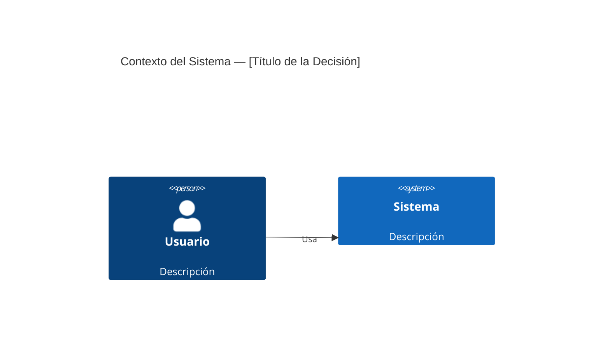

# ADR: [Título de la Decisión Arquitectónica]

## Estado

[draft | accepted | deprecated | superseded]

**Nota**: Este documento fue creado por un agente de IA y requiere revisión humana.

> **Regla de Inmutabilidad**: Una vez que un ADR alcanza el estado `accepted`, NO DEBE modificarse. Si la decisión cambia, crear un nuevo ADR con `supersedes: ADR-YYYY-MM-DD-NNN` en su frontmatter. El estado del ADR original cambia a `superseded`.

## Contexto

[Describir el contexto técnico y de negocio. Qué fuerzas están en juego (tecnológicas, políticas, sociales, relacionadas con el proyecto). El lenguaje debe ser neutral, simplemente describiendo los hechos.]

## Decisión

[Describir la decisión arquitectónica y la justificación. Usar voz activa: "Usaremos...", "Implementaremos..."]

## Alternativas Consideradas

### 1. [Alternativa 1]
- **Descripción**: [Qué es]
- **Pros**: [Ventajas]
- **Contras**: [Desventajas]
- **Por qué no**: [Razón para descartar]

### 2. [Alternativa 2]
- **Descripción**: [Qué es]
- **Pros**: [Ventajas]
- **Contras**: [Desventajas]
- **Por qué no**: [Razón para descartar]

## Consecuencias

> Evaluar consecuencias contra las características de calidad relevantes de ISO/IEC 25010:2023.
> Ver `00-governance/ISO-25010-2023-REFERENCE.md` para el modelo de calidad completo.

### Positivas
- [Beneficio 1]
- [Beneficio 2]

### Negativas
- [Costo o trade-off 1]
- [Costo o trade-off 2]

### Neutrales
- [Consecuencia que no es claramente positiva ni negativa]

### Evaluación de Impacto en Calidad

> Completar solo las características afectadas por esta decisión.

| Característica de Calidad (ISO 25010:2023) | Impacto | Descripción |
|--------------------------------------------|---------|-------------|
| Idoneidad Funcional | [+/-/~] | [Cómo afecta esta decisión la cobertura funcional, corrección o pertinencia] |
| Eficiencia de Desempeño | [+/-/~] | [Impacto en comportamiento temporal, utilización de recursos o capacidad] |
| Compatibilidad | [+/-/~] | [Impacto en coexistencia o interoperabilidad] |
| Capacidad de Interacción | [+/-/~] | [Impacto en aprendizaje, operabilidad, inclusividad, etc.] |
| Fiabilidad | [+/-/~] | [Impacto en ausencia de faltas, disponibilidad, tolerancia a fallos o recuperabilidad] |
| Seguridad | [+/-/~] | [Impacto en confidencialidad, integridad, autenticidad o resistencia] |
| Mantenibilidad | [+/-/~] | [Impacto en modularidad, analizabilidad, modificabilidad o capacidad de prueba] |
| Flexibilidad | [+/-/~] | [Impacto en adaptabilidad, instalabilidad o escalabilidad] |
| Seguridad Física (Safety) | [+/-/~] | [Impacto en restricciones operacionales, modo seguro, advertencias de peligro o integración segura] |

> **Leyenda**: `+` = impacto positivo, `-` = impacto negativo, `~` = neutral/trade-off. Eliminar filas no aplicables.

## Componentes Afectados

| Componente | Tipo de Cambio | Impacto |
|------------|----------------|---------|
| [Componente 1] | [Nuevo/Modificado/Eliminado] | [Alto/Medio/Bajo] |
| [Componente 2] | [Nuevo/Modificado/Eliminado] | [Alto/Medio/Bajo] |

## Plan de Implementación

1. [Paso 1]
2. [Paso 2]
3. [Paso 3]

## Criterios de Validación

> Definir criterios medibles para evaluar si esta decisión fue correcta.

| Métrica | Valor Objetivo | Método de Medición | Plazo |
|---------|---------------|-------------------|-------|
| [ej. Tiempo de respuesta] | [ej. < 200ms] | [ej. Prueba de carga en p95] | [ej. 30 días post-despliegue] |
| [Métrica 2] | [Objetivo] | [Método] | [Plazo] |

## Métricas de Éxito

- [Cómo sabremos que la decisión fue correcta]
- [Qué métricas monitorear]

## Diagrama de Arquitectura

> Incluir un diagrama C4 al nivel apropiado cuando esta decisión involucre cambios arquitectónicos.
> Ver `00-governance/C4-DIAGRAM-GUIDE.md` para referencia de sintaxis.

> **Guía**: Usar `C4Context` para decisiones a nivel de sistema, `C4Container` para decisiones a nivel de servicio/contenedor, `C4Component` para decisiones de módulos internos. Eliminar esta sección si no se necesita diagrama arquitectónico.

## Referencias

- [Enlace a documentación relevante]
- [Papers, artículos o recursos consultados]

---

## Historial de Revisiones

| Fecha | Autor | Cambio |
|-------|-------|--------|
| YYYY-MM-DD | [agente/humano] | Creación inicial |

<!-- Template: DevTrail | https://strangedays.tech -->
